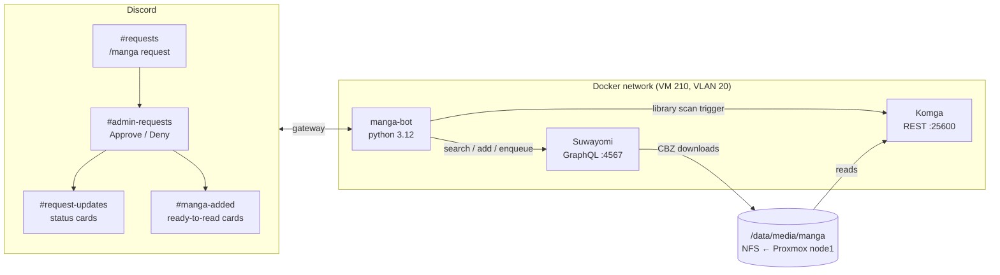

# Suwayomi Discord Bot

A Discord request bot for a self-hosted manga library — friends request series with `/manga request`, an admin approves with one click, chapters download automatically, and the library announces new arrivals when they're ready to read.

Built because no Overseerr/Requestrr equivalent exists for manga: the entire *arr request ecosystem is hard-wired to movies/TV. This fills that gap on top of [Suwayomi](https://github.com/Suwayomi/Suwayomi-Server) (source aggregation + downloads, GraphQL API) and [Komga](https://komga.org) (reading server, REST API).

## Architecture



**Request lifecycle:** search fans out concurrently across all configured sources → user picks from a select menu (results badged if already in library) → details card with cover, description, author, chapter count → Request button → approval card in an admin-only channel → Approve fires add-to-library + chapter enqueue → a background watcher polls download state → on completion, triggers a Komga scan and posts a showcase card. Admin requests skip approval and go straight to a download confirmation.

## Design decisions

**Contract-first GraphQL.** Every operation was hand-verified against the live server (v2.3.2238) with curl before any Python existed, and lives verbatim in [`graphql/`](graphql/). This surfaced four things guessing from docs would have missed:

| Finding | Consequence |
|---|---|
| `fetchSourceManga`, `fetchChapters`, `fetchManga` are **mutations**, not queries — they trigger live source scrapes | Latency budgeted accordingly; every command defers past Discord's 3s ack window |
| `enqueueChapterDownloads` auto-starts the downloader; `STOPPED` means *idle*, not broken | No start-kick needed; `startDownloader(input: {})` kept only as a recovery op |
| Manga/chapter ids are **per-instance database ids**, not source ids | Ids are never cached or persisted — Approve always re-fetches fresh |
| `about` was renamed `aboutServer`; `startDownloader` requires an empty `input` object | Schema drift is real; the contract files pin the verified shapes |

**Restart-surviving approvals without a database.** Approval cards use discord.py `DynamicItem` buttons: all state (`manga_id`, `requester_id`) is encoded in the `custom_id` and re-hydrated by regex when clicked — a pending request survives bot redeploys with zero persistence layer. Discord's message store *is* the queue.

**Raw HTTP over a GraphQL client library.** Nine static operations don't justify a client framework; `httpx` POSTs with query strings keep the protocol visible and the dependency tree short.

**Covers as attachments.** Suwayomi lives on an internal VLAN that Discord's embed proxy can't reach, so the bot fetches cover bytes over the LAN and re-uploads them (`attachment://cover.png`) — `discord.File` streams are single-use, so files are rebuilt from bytes per send.

**Bulk-download hygiene.** Chapter enqueues are batched (50/mutation) rather than fired as one giant call, and series over a configurable threshold get an explicit "all N chapters" warning — a 361-chapter request shouldn't look identical to a 12-chapter one.

**Graceful source degradation.** Multi-source search uses `asyncio.gather(return_exceptions=True)`: a slow or rate-limited source drops out of results instead of failing the search.

**Minimal footprint.** No privileged gateway intents (interactions need none), no exposed ports (egress-only container), non-root image, secrets via `env_file` — never baked into the image.

## Commands

| Command | Who | What |
|---|---|---|
| `/manga request <title>` | everyone | multi-source search → details card → request (or direct download for admin) |
| `/manga status` | everyone | current download queue with per-chapter progress |
| `/manga scan` | admin | manual Komga library scan |

All commands are locked to a single requests channel; use elsewhere gets an ephemeral redirect.

## Configuration

Copy `.env.example` to `.env`:

| Variable | Purpose |
|---|---|
| `DISCORD_TOKEN` | bot token (Developer Portal → Bot) |
| `GUILD_ID`, `ADMIN_USER_ID` | your server + approver |
| `SUWAYOMI_URL`, `KOMGA_URL` | service endpoints (container DNS in prod, LAN IP in dev) |
| `SUWAYOMI_SOURCE_IDS` | comma-separated source ids (query the `sources` op to list) |
| `KOMGA_API_KEY`, `KOMGA_LIBRARY_ID` | scan-trigger credentials |
| `REQUESTS_CHANNEL_ID` + 3 more | the four routing channels |
| `BULK_CONFIRM_THRESHOLD` | chapter count that triggers the large-series warning (default 100) |
| `FORCE_APPROVAL` | `1` routes admin through the approval flow — for solo testing |

## Deploy

Runs as a service in the same compose stack as Suwayomi/Komga:

```yaml
  manga-bot:
    build: ./manga-bot
    container_name: manga-bot
    env_file: ./manga-bot/.env
    restart: unless-stopped
    depends_on: [suwayomi, komga]
```

Redeploy: `git pull && docker compose up -d --build manga-bot`

Dev loop: run `python -m bot.main` locally against the LAN URLs (stop the prod container first — two processes on one token race on interactions).

## Limitations / next

- Completion watchers are in-memory: a restart mid-download orphans the notification (the download itself is unaffected; Komga's scheduled scan is the backstop)
- Same series requested from two sources creates duplicate Komga entries — the in-library badge mitigates at request time; cross-source dedupe is future work
- Approval history lives only in Discord messages; no request analytics
